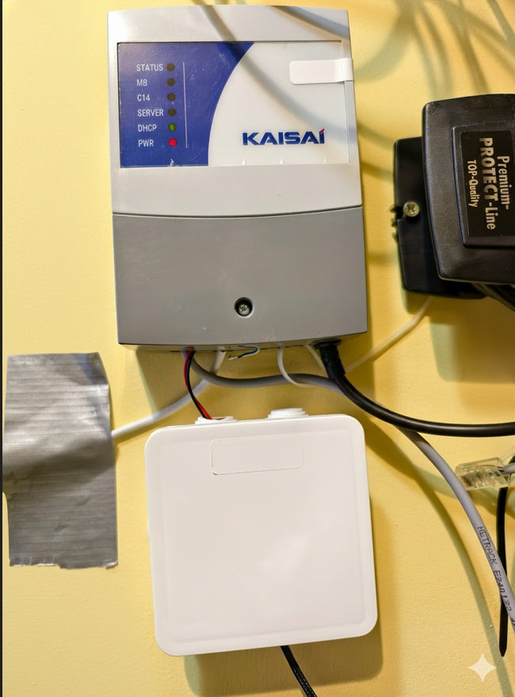
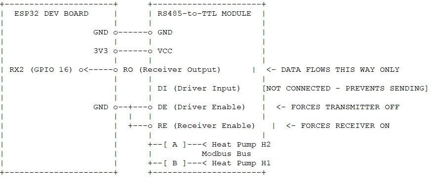
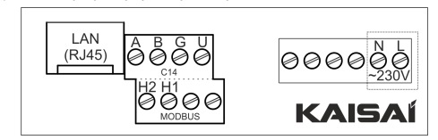
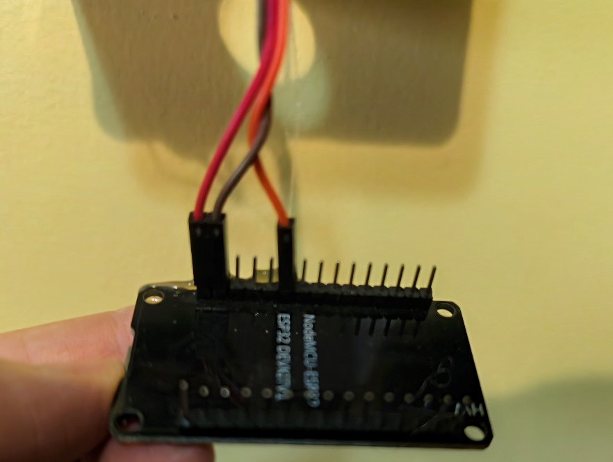
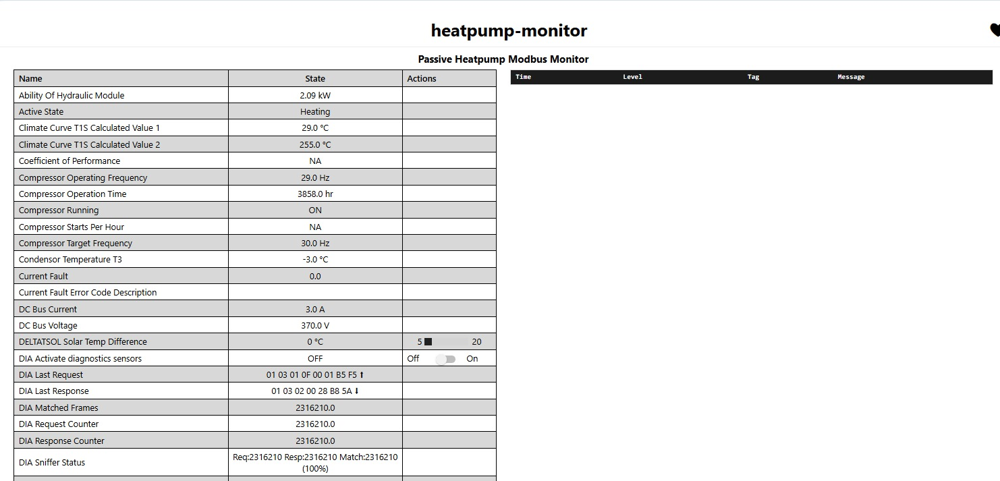

# ESPHome Passive Modbus Monitor for Kaisai/Midea Heat Pumps

This project provides a complete solution for passively monitoring Kaisai, Midea, and other rebranded air-to-water heat pumps via their Modbus RTU (RS485) interface. It uses an ESP32 and ESPHome to "sniff" the communication between the controller and the heat pump, allowing for seamless integration into Home Assistant without sending any active requests that could conflict with the main controller.

This **"listen-only**" approach is highly stable and safe, as it never writes to the Modbus bus unless explicitly configured for active control.




## Features

- **Passive Sniffing:** Reads all data without interfering with the heat pump's own controller.
- **Full Entity Support:** Decodes a comprehensive list of over 100 sensors and parameters, from basic temperatures to advanced configuration settings.
- **Intelligent Publishing:** Automatically detects the end of a data burst and publishes all updated values to Home Assistant at once, ensuring data consistency and efficiency.
- **On-Demand Diagnostics:** Includes a switch in Home Assistant to enable verbose logging and an unknown-register-detection feature, making it easy to discover new Modbus registers.
- **High Stability:** Designed for long-term, reliable operation with failsafe mechanisms and no reliance on active polling.
- **Low-Cost Hardware:** Built with a standard ESP32 and a cheap RS485-to-TTL converter.

## Hardware Requirements

| Component | Quantity | Notes |
| :--- | :--- | :--- |
| ESP32 Development Board | 1 | A NodeMCU ESP32 DEVKITV1 was used, but any ESP32 board will work. |
| RS485 to TTL Converter | 1 | A **MAX485** 3.3V/5V module [RS485 to TTL Converter](https://pl.aliexpress.com/w/wholesale-max485.html?g=y&SearchText=max485&sortType=total_tranpro_desc) .Other module may not work. |
| Small Junction Box | 1 | To house the electronics safely. |
| 5V DC Power Supply | 1 | A micro-USB phone charger is perfect. |
| Jumper Wires | - | For connecting the components. |


## Hardware Assembly & Wiring

The assembly involves connecting the ESP32 to the RS485 converter and then tapping into the heat pump's Modbus communication lines in parallel.

**⚠️ Disclaimer:** You are working with your heat pump's control electronics. Proceed at your own risk. Ensure the heat pump is powered off before making any connections.

### Wiring Diagram

The key is to connect the `A` and `B` lines from the heat pump's network module to the `A` and `B` terminals on the RS485 converter. Polarity matters, but if it doesn't work the first time, simply swap the A and B wires.

**ESP32 <-> RS485 to TTL Module:**

| ESP32 Pin | RS485 Module Pin | Description |
| :--- | :--- | :--- |
| `GND` | `GND` | Ground |
| `Vout` (3V) | `VCC` | 3V Power |
| `GPIO 16` (RX2) | `RO` | Receiver Output (Data from bus to ESP32) |
| *Not Connected* | `DI` | Driver Input (Not used in passive mode) |
| `GND` | `DE` | Driver Enable Connected to GND |
| `GND` | `RE` | Receiver Enable Connected to GND|


**RS485 Module <-> Heat Pump Network Module (e.g., Kaisai):**


| RS485 Module Terminal | Heat Pump Terminal | 
| :--- | :--- | 
| `A` | `H2` | 
| `B` | `H1` | 

Most RS485 modules include a 120Ω termination resistor (often labeled R7) soldered onto the board. This resistor is only needed at the two physical ends of a Modbus bus. Since this sniffer is being connected in the middle of the bus, you must remove this resistor. De-soldering R7 will prevent it from interfering with the existing bus communication.



### Installation Photos

Here is how the final assembly looks in practice.

1.  **The Electronics:** The ESP32 board connected to the RS485-to-TTL converter.
2.  **Kaisai Network Module:** The RS485 `A` and `B` terminals where the sniffer is connected in parallel.
3.  **The RS485 Converter:** Close-up of the converter module with wires attached.





## Software Setup

This project uses **ESPHome**. You will need a running Home Assistant instance with the ESPHome add-on.

1.  **Create `secrets.yaml`:**
    In your ESPHome configuration directory, create a file named `secrets.yaml` and add your Wi-Fi credentials:
    ```yaml
    wifi_ssid: "YourWiFi_SSID"
    wifi_password: "YourWiFi_Password"
    ```

2.  **Create New ESPHome Device:**
    - In the ESPHome dashboard, create a new device and name it `heatpump-monitor`.
    - When prompted, choose the ESP32 board type.
    - Skip the basic installation and click "EDIT" to open the YAML configuration file.

3.  **Copy the Configuration:**
    - Copy the entire content of the `heatpump-monitor.yaml` file from this repository.
    - Paste it into the ESPHome editor, completely replacing the default content.

4.  **Install:**
    - Click "SAVE", then "INSTALL".
    - For the first-time installation, choose "Plug into this computer" and follow the prompts to flash the device via a USB cable.
    - After the first flash, all subsequent updates can be done "Wirelessly" (OTA).



## Usage in Home Assistant

Once the device is flashed and running, Home Assistant should automatically discover it.
1.  Go to **Settings -> Devices & Services**. A new "ESPHome" device should be discovered.
2.  Click **CONFIGURE** and **SUBMIT** to add it to Home Assistant.
3.  All sensors and controls will be available with the prefix `heatpump_monitor`.

### Diagnostics

A special switch named `DIA Activate diagnostics sensors` is included. When you turn this on:
- Detailed statistics about the Modbus communication (request/response/match counts) become visible.
- The system will start logging any Modbus requests for registers that are not yet decoded in the configuration file. Check the ESPHome device logs to see these warnings. This is a powerful tool for discovering new parameters!

## How It Works (A Brief Technical Overview)

The core of this project is a C++ lambda function within ESPHome's `interval` component that runs every 10 milliseconds.
1.  **Buffering:** A fast `1ms` interval reads every available byte from the UART into a `frame_buffer`.
2.  **Frame Detection:** The `10ms` loop inspects the buffer, looking for valid Modbus RTU frames (both requests and responses) by checking the device address, function code, and CRC checksum.
3.  **Data Storage:** When a valid response from the heat pump (address `0x01`) is matched with a preceding request, the data from the response is stored in a global `std::map` called `holding_registers`, mapping register addresses to their values.
4.  **Intelligent Publishing:** After successfully matching a frame, a `publish_pending` flag is set. A separate `1s` interval checks this flag. If the flag is set AND there has been a 1-second silence on the bus (indicating the end of a communication burst), it triggers a script.
5.  **Script Execution:** The `publish_all_states` script reads all values from the `holding_registers` map, performs necessary calculations (e.g., for signed temperatures or bitmasking), and publishes the state for every entity to Home Assistant.

This event-driven approach is far more efficient and robust than fixed-interval polling.

## Credits

- This project was developed by [TheMiniatureGamer].
- The sniffing logic and approach were inspired by various online resources, including  https://github.com/Mosibi/Midea-heat-pump-ESPHome.

## License

This project is licensed under the MIT License. See the `LICENSE` file for details.
